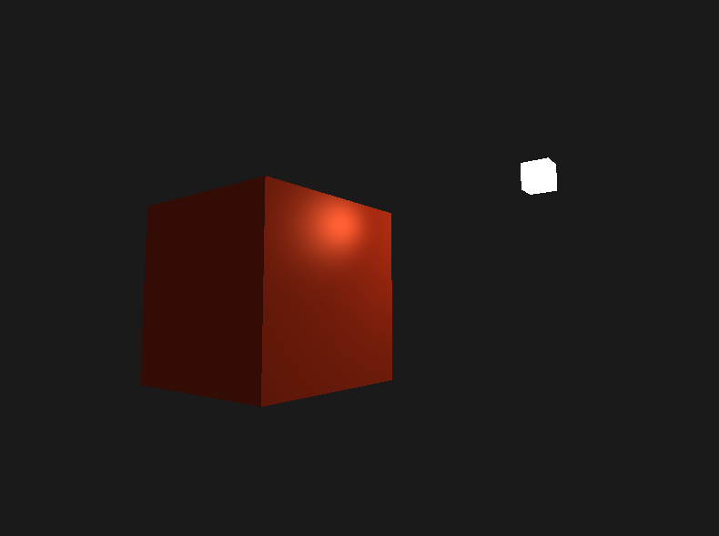

# Opengl Template/Game Engine

A work-in-progress 3D Renderer/Game Engine built with OpenGL & C++.

## Features
- [x] Game Loop
- [ ] Basic Meshes
    - [x] Cube
    - [ ] Sphere
    - [ ] Capsule
    - [ ] Cylinder
- [ ] Camera
    - [x] Scene Camera
    - [ ] First Persson/Third Person Camera
- [ ] Lighting
    - [x] Phong Lighting
    - [ ] PBR
- [ ] Model Loading
- [ ] Text Rendering
- [ ] GUI

## References
[https://learnopengl.com](https://learnopengl.com/)